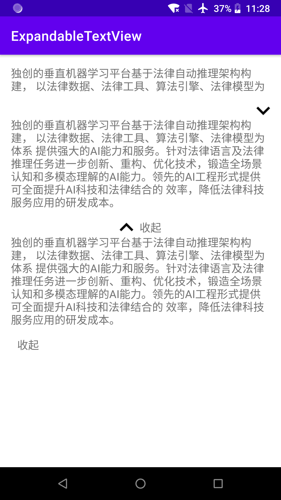

# ExpandableTextView

一个可以展开的Textview组件,支持多种样式。

## Demo



## 依赖

在你项目的build.gradle文件中添加jitpack的仓库

```groovy
allprojects {
	repositories {
		...
        maven { url 'https://jitpack.io' }
    }
}
```

然后在你要使用的模块中添加如下依赖：

```groovy
dependencies {
    implementation 'com.github.U2tzJTNE:ExpandableTextView:1.0'
}
```

## 支持的属性

| 属性                    | 功能                   | 可选值                  |
| ----------------------- | :--------------------- | ----------------------- |
| maxCollapsedLines       | 展示多少行文字         | int                     |
| animDuration            | 动画持续时间           | int(单位ms)             |
| animAlphaStart          | 动画开始时的透明度     | 0-100                   |
| expandIndicatorImage    | 展开时的图片           |                         |
| collapseIndicatorImage  | 收缩时的图片           |                         |
| expandIndicatorText     | 展开时的文字           | 字符串或资源地址        |
| collapseIndicatorText   | 收缩时的文字           | 字符串或资源地址        |
| expandToggleOnTextClick | 点击文字时是否可以展开 | true/false              |
| expandToggleType        | 展开的样式             | Image/Text/ImageAndText |
| expandableTextId        | 文本的id               |                         |
| expandCollapseToggleId  | 展开布局的id           |                         |

## 代码示例

```html
<com.u2tzjtne.expandabletextview.ExpandableTextView
        android:id="@+id/expand_text_view_3"
        android:layout_width="match_parent"
        android:layout_height="wrap_content"
        android:orientation="vertical"
        expandableTextView:animDuration="200"
        expandableTextView:collapseIndicatorImage="@drawable/ic_expand_less"
        expandableTextView:collapseIndicatorText="收起"
        expandableTextView:expandIndicatorImage="@drawable/ic_expand_more"
        expandableTextView:expandIndicatorText="展开"
        expandableTextView:expandToggleType="ImageAndText"
        expandableTextView:maxCollapsedLines="2">

        <TextView
            android:id="@id/expandable_text"
            android:layout_width="match_parent"
            android:layout_height="wrap_content"
            android:background="@null"
            android:textSize="16sp" />

        <LinearLayout
            android:id="@+id/expand_collapse_layout"
            android:layout_width="wrap_content"
            android:layout_height="wrap_content"
            android:layout_gravity="center"
            android:layout_marginTop="15dp"
            android:gravity="center_vertical"
            android:orientation="horizontal">

            <ImageButton
                android:id="@id/expand_collapse_image"
                android:layout_width="20dp"
                android:layout_height="20dp"
                android:background="@android:color/transparent"
                android:scaleType="fitXY" />

            <TextView
                android:id="@id/expand_collapse_text"
                android:layout_width="wrap_content"
                android:layout_height="wrap_content"
                android:layout_marginStart="9dp"
                android:text="展开"
                android:textSize="16sp" />

        </LinearLayout>

</com.u2tzjtne.expandabletextview.ExpandableTextView>
```